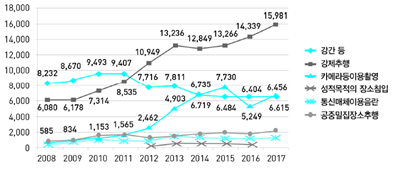
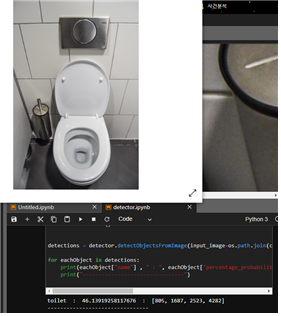
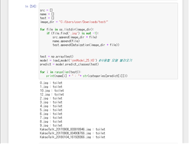
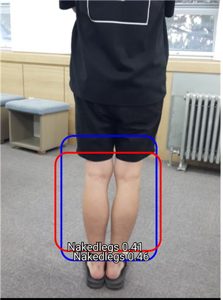
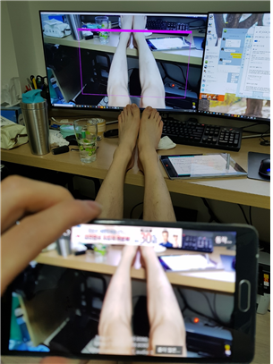
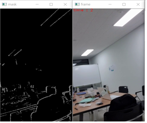
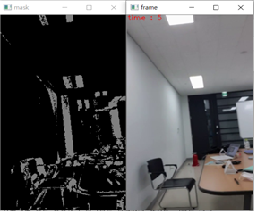
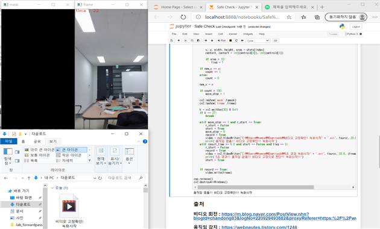
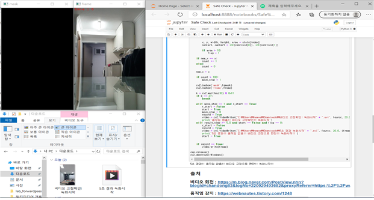
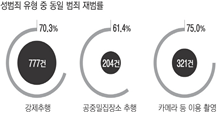

# 팀명, 모델명
SafeTeam
Safe Camera(불법촬영 방지)

#  팀 구성
지도교수 :  김병정

팀장     : [곽찬우](https://github.com/kcw32/Hallym_Capston_Safe/tree/kcw32-darknetBranch)

팀원 : [박인근](https://github.com/kcw32/Hallym_Capston_Safe/tree/Parkingeun)
 
팀원 : [백예지](https://github.com/kcw32/Hallym_Capston_Safe/tree/BaekYeji)

팀원  : [이유나](https://github.com/kcw32/Hallym_Capston_Safe/tree/YunaLee)

# 주제
스마트폰을 통한 불법촬영 방지, 예방 

# 프로젝트 개요
요근래 성범죄가 엄청난 사회적 이슈가 되고있다. 직접적인 피해를 입는 성범죄도 있지만 많은 전자기기들이 대중화가 되고 난 후
타인을 몰래 찍는 몰래카메라 범죄가 나날이 기승을 부리고 있다. 그래서 이러한 몰래카메라 범죄를 예방을 하기위해 safe camera
프로젝트를 계획했다.

# 프로젝트 내용 & 목표

# 과제 목적
최근 KBS 화장실 불법촬영,n번방 사건 등과 관련되어 디지털 성범죄가 사회적 관심사로 대두되고 있다. 디지털 성범죄는 카메라나 디지털 기기 등을 이용하여 성적 욕망 또는 수치심을 유발할 수 있는 다른 사람의 신체를 당사자의 동의 없이 촬영하거나 불법 촬영물을 동의 없이 유포하는 성범죄를 말한다. 디지털 성범죄 4가지 유형 중 하나인 불법촬영은 신체 일부나 특정행위를 불법으로 촬영하는 행위로 성적 수치심을 유발의 여지가 있는 사진 및 동영상을 촬영했다면 당사자의 동의 여부에 상관없이 촬영 자체만으로도 범죄에 해당한다. 여성은 성폭행범죄보다 불법촬영에 더 높은 불안감을 보인다. 

서울 여성 3,892명 대상으로 범죄별 불안도 설문조사 결과: 불법촬영 1,246명(32.0%), 성폭행˙추행 1,131명(29.1%), 주거침입 910명(23.4%), 스토킹 595명(15.3%) 순임[2019년 서울경찰청 자료]
 불법촬영에 대해 불안감이 큰 것은 피해자가 일상생활 중 부지불식간에 촬영을 당하고, 촬영된 영상이 인터넷을 통해 확산되며 피해 정도가 막심하며, 한번 배포된 영상을 영구히 삭제하는 것은 거의 불가능함에 기인한 것으로 보인다. 법무부 범죄예방정책국. [2020]. 성범죄백서

카메라 등 이용촬영 범죄는 2013년 412건(7.0%)을 시작으로 그 수가 급격히 증가하여 2018년에는 2,388건(17.0%)까지 증가하였고 전체 성범죄 비율 중 두 번째로 큰 12.4%를 차지하고 있다. 그중 비동의 촬영이 가장 많고, 그다음이 다중이용시설, 즉 화장실이나 지하철 내에서 모르는 사람에 의해 몰래 찍히는 다중이용시설 내 촬영이 많았다. 

현재 불법촬영 방지보다는 탐지를 목적으로 맞춘 탐지 장비들이 개발되어왔다. 경찰에 적발되는 불법 촬영 사례를 봐도 이동하면서 찍고 도망가는 불법 촬영이 대다수며 탐지기가 제대로 작동한다 해도 누군가 불법 촬영을 하고 도망간다면 무용지물이라는 문제점이 있다. 

 이에 우리는 촬영하는 카메라 프레임 안에 아래와 같은 조건들이 성립될 경우, 즉각 진동이나 알림을 발생시키거나 카메라를 종료시키는 프로그램을 구현하는 것을 목표로 한다. 촬영장소가 공중화장실인 경우, 노출이 있는 신체부위(맨다리)를 촬영하는 경우 그리고 비동의 동영상 촬영(고정된 배경으로 움직임이 탐지)일 경우이다. openCV, Anaconda, VOLO 등을 활용하여 3가지 딥러닝 모델을 만들고, 이를 통합하여 모바일 환경에 연결하는 것을 목표로 한다. 

# 과제 내용

현재 여러 가지의 모델을 나눠서 제작하고 있다. 이 프로젝트를 구상할 때 생각했던 몇 가지 모델이 있다. 
 
1. 공중 화장실인지 탐지하는 모델
2. 노출이 많은 신체 부위(다리, 몸)을 탐지하는 모델
가. 2번에서 탐지된 사진에서 눈을 찾아내는 모델
3. 영상촬영이 진행되고 있을 경우 움직임을 감지하여 움직임이 너무 작으면(카메라가 고정) 탐지 시작
가. 3번의 영상 속에서 노출이 많은 사람이 감지

이 3가지 모델에 대해서 제작 중이다.

모델 1번은 구글에 공중화장실과 관련된 키워드(공중화장실, 도서관 화장실, 클럽 화장실 등)를 검색하여 크롬 웹스토어에서 제공하는 이미지 크롤링 어플 (FatKun)을 사용하여 데이터셋을 확보하였다. 
크게 세 단계로 나누어 진행하였다.

첫 번째 단계로는 이미지 크롤링을 해 얻은 데이터로 데이터셋을 만들었다. openCV 라이브러리 사용하였다.  먼저 나누어줄 카테고리를 정하였는데, 이 프로젝트에서는 해당 데이터가 화장실인지 아닌지만 판별하므로 카테고리를 'toilet', 'etc' 이렇게 두 개로 나누어 진행하였다. 카테고리를 나눈 후에 X축과 Y 축의 크기를 정했다. 테스트하기 위해서 두 크기를 모두 28사이즈를 주었는데 해당 사이즈, 즉 정사각형으로 크기를 주어 해당 이미지를 지정한 사이즈로 나누어 이미지 파일을 읽어 rgb 값으로 배열에 저장했다. 따라서 배열에는 원본 사진을 지정한 크기로 자른 값의 rgb 데이터들이 들어간다.  numpy 라이브러리를 사용하여 데이터 전처리가 끝난 후에는 train dataset과 test dataset으로 나누어 저장했다. 

두 번째 단계에서는 첫 번째 단계에서 만들어진 데이터셋으로 화장실 인지 아닌지를 구분하는 훈련을 시켰다. 3x3 크기의 컨볼루션 레이어를 16개의 필터 수에 처음 생성한다. 활성화 함수는 relu를 사용하며 input_shape는 28x28 크기와 컬러 값이니 3 -> (28,28,3)의 튜플 값을 가진다. Flatten()은 CNN에서 컨볼루션 레이어나 맥스 풀링을 거치면 주요 특징만 추출되고 전결합층에 전달되어 학습되는데, 이때 컨볼루션이나 맥스 풀링은 2차원을 주로 다루지만 전결합층에 전달을 하기 위해서는 1차원으로 바꾸어주어야 한다. 이때 Flatten()을 사용한다. 
그리고 마지막으로 훈련시킨 데이터셋을 이용하여 테스트해보았다. 

마지막으로 샘플 이미지들로 테스트를 했다. 앞서 생성한 모델로 샘플 이미지들을 테스트하여 결과를 얻어냈다. 
Object detection기반으로 변기를 탐지한다. 오픈소스인 ImageAI를 사용하였으며 이것은 RetinaNet, YOLOv3 and TinyYOLOv3에 대해 지원한다. 속도와 임베디드 장치에 최적화를 위해 TinyYOLOv3 모델을 사용하였다. output으로는 개체이름, 감지율, 개체 경계 상자의 x1, y1, x2 그리고 y2좌표를 출력한다.

2번 모델은 노출이 있는 신체부위 그 중에서도 맨다리를 촬영하는 것을 방지하는 모델이다. 현재 나와 있는 다양한 형태의 이미지 관련 모델 중에서 Object Detection. 그중에서도 YOLO와 R-CNN이라는 알고리즘을 사용한다. 그러나 R-CNN은 너무 모델이 무거워 데스크탑에서도 돌리기 힘들었고 모바일에서 구현을 목적으로 하는 이번 프로젝트에서 알맞지 않다고 생각하여 배제하였다. 

모바일에 구현하기 전 데스크탑을 이용하여 모델을 훈련시켰다. darknet을 이용하여 Yolov3, Yolov3-tiny, Yolov4, Yolov4Custom 모델을 학습시켰다. 세 모델 모두 좋은 인식률을 보여주었다. 특히 새로운 버전인 Yolov4가 나오면서 다양한 크기의 레이어가 추가되어 작은 오브젝트에 대해서도 매우 뛰어난 인식률을 보여주었다. 

모바일에서 구현하기 위해서는 텐서플로우를 통해 구현하게 되는데, darknet의 텐서플로우 버전인 darkflow를 통해 훈련을 시켰다. 단점은 darknet처럼 업데이트가 최신으로 유지되지 않아 구형모델들만 사용할 수 있었고 동일한 조건에서 사용시에 darkflow모델이 darknet 모델보다 2.7배 느리다고 한다. 여러 모델(Yolo, Tiny-yolo, Tiny-yolo-4c, Tiny-yolo-voc)을 훈련시켜보고 테스트를 해보았는데 모바일에서 구현하기 가장 좋은 모델은 Tiny-yolo-voc 모델이었다. 그래서 텐서플로우를 통해 모바일에 구현을 하였다. 구현에 사용된 모델은 갤럭시 노트 4를 사용하였고 안드로이드 버전은 6.0을 사용하였다. 

모든 프레임을 감지하지는 못하지만 불법촬영을 감지하는데는 충분한 성능을 보여주었다. 최신기기로 실험한다면 훨씬 더 많은 프레임을 처리할 수 있을 것이다. 먼저 훈련한 Yolov4 모델이 매우 좋은 인식률을 보여주어 어떻게 이 모델을 사용할 수 없을까 고민을 한 뒤 두 가지 방법으로 구현하였다. 

첫 번째는 경량화 된 모델을 핸드폰에 구현하여 핸드폰 안에서 탐지와 알림까지 하는 형태, 두 번째는 핸드폰이 촬영하고 있는 영상을 무선 연결을 통해 테스크탑으로 받아와 탐지는 데스크탑에서 하고 알림은 핸드폰에서 하는 형태이다. 무선 연결을 통해 영상을 받아와 데스크탑에서 탐지하는 방식은 darknet제작자인 AlexeyAB도 github에 제시하고 있는 구현방법이다. 

첫 번째 형태의 장점은 핸드폰만 있으면 된다는 것이다. 그러나 비교적 떨어지는 성능을 가지고 있다. 반면 두 번째 형태의 장점은 뛰어난 성능을 가지고 있고 GPU(GTX1070Ti)를 사용하면 초당 30프레임 가까이 처리하면서도 자원에 여유가 남는다. 괜찮은 GPU를 가지고 있다면 하나의 컴퓨터로 여러 개의 영상을 처리할 수 있다. 단점은 영상을 처리할 컴퓨터가 따로 필요하다는 것이고 핸드폰에서도 영상을 무선으로 보내야 된다는 점이다. 즉 무선연결을 끊어버린다면 감지가 불가능하다는 것이다.     

첫 번째 구현은 어플형태로 구현을 하였다. 핸드폰에서 실행을 하게 되면 카메라가 동작하는데 맨다리 외에 다른 것들을 촬영한다면 핸드폰은 아무런 반응을 하지 않는다. 하지만 맨다리가 촬영범위 안에 들어올 경우 탐지하여 진동과 알림소리를 내며 지속적으로 촬영 중임을 알린다. 진동소리와 알림소리가 매우 커 촬영하는 것이 사실상 불가능하다. 그러나 촬영 자체를 막지는 않는다. 만약 어떠한 이유(자신의 신체나 모형을 촬영할 경우)로 인해 탐지가 작동 할 경우 소리와 진동을 무시할 수 있는 상황이라면 촬영이 가능하다. 또한 현재로써는 촬영 자체는 가능하게 하고 경고와 진동으로 불법촬영을 방지하고 있다. 고민 했었던 다른 방법이 있는데 다리가 검출 되었을시에 즉시 어플을 종료시키는 것이다. 종료 대신 경고와 진동으로 대체한 것은 어느 정도의 오차율이 있기 때문에 오작동 돼서 종료되어버리는 상황을 만들지 않기 위해서이다. 추후 모델의 정확도가 개선된다면 경고와 진동대신 어플을 종료시키는 방법으로도 사용할 수 있다. 

두 번째 구현은 모바일에서 원격으로 영상을 보내 데스크톱에서 받고 데스크톱에서 영상을 분석하는 형태이다. Yolov4는 워낙 많은 레이어를 가지고 있어 인식률이 매우 뛰어나지만 데스크톱 환경에서 GPU(GTX1070TI)를 80% 정도 사용 하였다. 그러나 매 초당 30프레임을 감지하는 뛰어난 성능을 보여주었다. 레이어가 매우 적은 Tiny 모델을 사용하게 되면 데스크톱 한 대로 여러 영상을 감지할 수 있을 것이다. 그러나 영상을 계속해서 원격으로 보내야 하는 단점이 존재한다. darknet을 사용해 훈련한 모델들을 사용하기에 매우 뛰어난 정확도와 속도가 큰 장점이다. 

 3번 모델, 움직이는 물체를 검출은 openCV에서 제공하는 Background Subtraction 알고리즘의 하나인 BackgroundSubtractorMOG2를 사용하였다. 또한, BackgroundSubtractorMOG2 사용해서 물체를 검출하고 검출된 물체를 라벨링하여 물체를 추적하도록 하였다. BackgroundSubtractorMOG2은 가우시안 기반 배경 세분화 알고리즘으로서 배경 픽셀을 가져와 각 픽셀에 가우시안 분포를 할당한다. 본 프로그램에서는 history와 varThreshold 의 값만 변경해주면서 프로그래밍하였다. 인자만 변경하면 움직이는 사람도 추적할 수 있지만, 하나의 물체로 인식하지 않고 여러 물체로 인식된다. 따라서 하나의 물체로 묶어줄 추가 작업이 필요하지만, 본 주제는 물체 추적이 아닌 단순 움직임 감지만이 필요하다고 생각하여 추가 작업 없이 구현을 완료하였다. 
 
 영상이 시작되면 움직이는 물체의 좌표를 모두 확인한다. 다음으로 영상의 시작시간부터 시간을 확인하고 5초 동안 영상에서 움직임을 감지하지 못하면 녹화를 시작한다. 시간을 확인하는 방법으로는 time을 import 하여 사용하였다. 또한, 시작부터 움직임이 있는 영상일 경우에는 영상이 재생되다가 움직임을 멈추고 고정되었다고 판단될 경우 녹화를 시작한다. 고정된 화면임을 확인하는 것은 물체의 x좌표가 이전에 검출한 물체의 x좌표와 어느정도의 시간동안 같은 값인지 확인하고 변하지 않을 경우 고정된 영상임을 확인하였다. 
 
 구현 과정에서 시간 확인, 처음부터 고정된 영상인지 아닌지 확인 등의 여러 상황을 판단하고 영상을 녹화하는 것에 어려움을 겪었으나 어느 정도 구현을 완료하였다. 최종적으로 핸드폰으로도 구현이 완료된 1번 모델과 같이 연동해 구현 완료 하고 싶었으나 능력과 시간 부족으로 인해 아쉬움이 남았다.

# 기대효과
최종적으로 완성된 프로그램의 활용방안으로는 불법 촬영 전과가 있는 성범죄자들에게 Safe Camera를 적용하여 불법 촬영 재발을 막는 것이다. 통계에 따르면 불법 촬영은 재범률이 75% 정도이다. 

[이미지 출처 : 김원진 기자, 「불법촬영 처벌받고도 재범… 4명 중 3명은 또 찍다 ‘덜미’」, 경향신문]
이 통계를 통해 알 수 있는 것은 불법 촬영을 저지른 대부분의 범죄자들이 다시 사회로 나와 불법 촬영을 한다는 것이다. 국가에서 처벌을 받는 수위로는 불법 촬영의 재발을 막는데 효과가 미미하다. 이러한 불법 촬영 재발 현상을 Safe Camera가 해소할 수 있다. 

불법 촬영 범죄 이력이 있는 전과자들이 사용하는 핸드폰에 의무적으로 일정 기간 동안 Safe Camera를 설치한다. 어디서든 촬영을 할 때 불법 촬영을 시도한다면 Safe Camera에 설정되어 있는 진동과 경고음이 울리게 되어 촬영을 불가능하게 한다. 또한 Safe Camera를 사용하면 불법 촬영을 시도한 당사자뿐만 아니라 주변 사람들에게도 알려 누가 범인인지, 누가 대상인지를 빠르게 파악을 할 수 있다. 이러한 기능을 통해 불법 촬영 전과자들에게 있어서 불법 촬영을 시도하면 그 즉시 적발됨과 동시에 주변 사람들에게도 크게 알려 불법 촬영을 하는데 두려움을 심어주게 되어 재범률을 낮추는 효과를 기대할 수가 있다.

19년도 기사를 보면 불법 촬영 7년 새 약 4배 급증했지만 구속은 고작 2%대라는 기사가 있다. 2011-2016년 구속수사의 비율은 2.1-2.9%였으며 입법조사처는 "불구속 수사가 이뤄지는 경우 피해 촬영물에 대한 증거의 은닉, 폐기, 나아가 2차 유포의 가능성이 높다"라고 지적했다. 이렇듯 범죄 비율에 비해 솜방망이 처벌이 이루어지기 때문에 Safe Camera를 통해 불법 촬영을 하는 범죄자를 줄일 수 있는 효과를 기대할 수 있다.
[참고 : 선명수 기자, 「불법촬영 7년 새 4배 급증에도 구속은 고작 2%대」, 경향신문]

더 나아가 불법 촬영 범죄 이력이 있는 성범죄자 뿐만이 아니라 또 다른 성범죄자들에게도 의무적으로 Safe Camera를 설치한다. 그 후 현재 사용되고 있는 '성범죄자 알림e' 처럼 불법 촬영으로 인한 두려움을 가진 사람들이 주위에 Safe Camera의 진동과 경고음이 울렸는지 실시간으로 확인할 수 있는 앱을 만들어 불법 촬영으로 인한 두려움을 조금이나마 덜어낼 수 있는 효과를 기대할 수 있다.

그래서 최종적으로 Safe Camera는 그동안 불법 촬영 범죄를 저질렀을 때 받는 미미한 처벌과는 다르게 피해자들이 느끼는 현실의 문제들을 해결해 줄 수 있다.

# 개발 환경
darknet

 Yolo v3 in other frameworks
 
   TensorFlow
   
   OpenCV/Python
   
 Yolo v4
